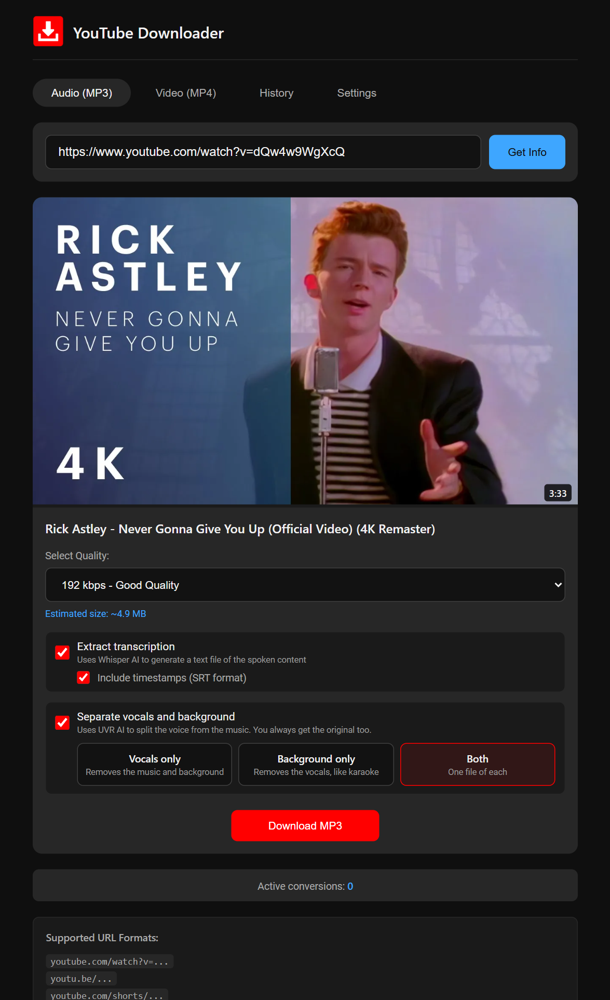
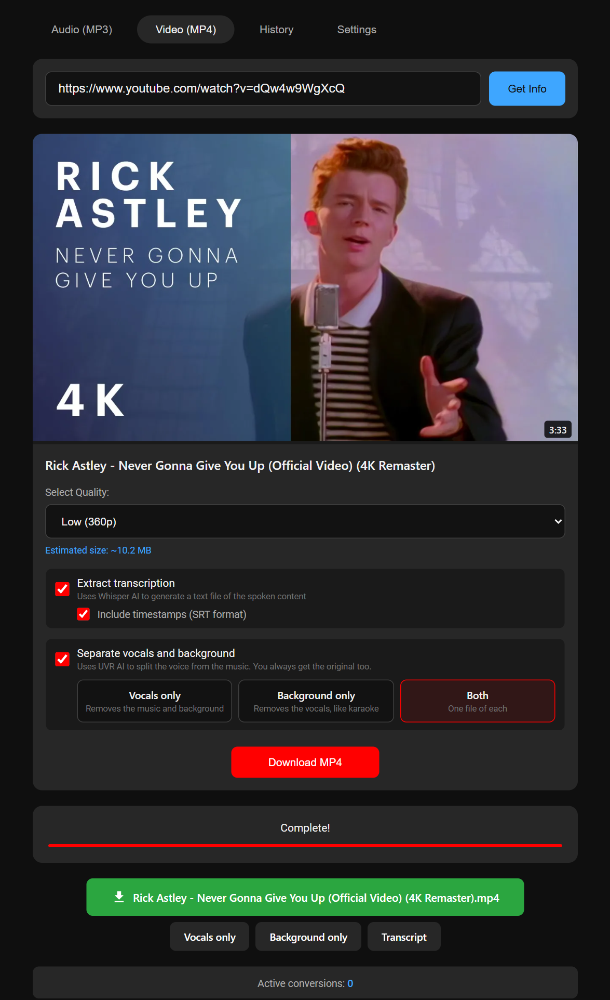
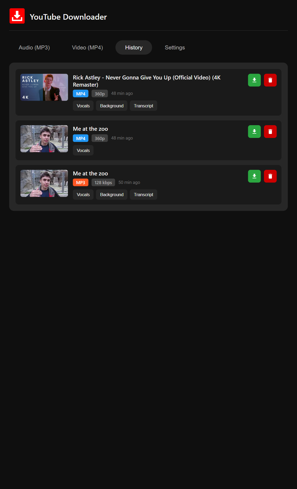

# ytdl-web

A self-hosted web server that downloads YouTube videos as MP3 audio or MP4 video files. Features a modern dark-mode UI, real-time progress tracking, download history, and AI-powered transcription using Whisper.

| Audio | Video | History |
|-------|-------|---------|
|  |  |  |

## Features

- **Audio & Video Downloads** - Download as MP3 (audio) or MP4 (video)
- **Quality Selection** - Choose bitrate (64-320 kbps) or resolution (360p-4K)
- **AI Transcription** - Extract spoken text using Whisper Large V3 Turbo (GPU-accelerated)
- **Timestamps / SRT** - Optionally include timestamps in SRT format for captions
- **Real-time Progress** - Live progress bar with percentage updates
- **Download History** - Track past downloads with thumbnails, persists across page refreshes
- **Mobile Responsive** - Works great on phones and tablets
- **Multi-user Support** - Handle concurrent downloads
- **Video Preview** - Thumbnail, title, and duration before downloading
- **File Size Estimates** - See approximate file size before download
- **Auto-cleanup** - Old downloads removed after 1 hour
- **GPU Optimized** - Runs on NVIDIA GPUs via CUDA for fast transcription

## Quick Start

### Docker Compose (Recommended)

Requires an NVIDIA GPU with [NVIDIA Container Toolkit](https://docs.nvidia.com/datacenter/cloud-native/container-toolkit/latest/install-guide.html) installed.

```bash
git clone https://github.com/hypersniper05/ytdl-web.git
cd ytdl-web
docker compose up -d
```

Open `http://localhost:6080` in your browser.

### Docker Run

```bash
docker build -t ytdl-web .
docker run -d -p 6080:8080 --gpus 1 --name ytdl-web ytdl-web
```

### Manual Installation

```bash
# Install ffmpeg
# Ubuntu/Debian: sudo apt install ffmpeg
# macOS: brew install ffmpeg
# Windows: winget install FFmpeg

pip install yt-dlp
# For transcription support:
pip install torch --index-url https://download.pytorch.org/whl/cu128
pip install "transformers>=4.40.0" accelerate

python server.py
```

## Usage

1. Open `http://localhost:6080` in your browser
2. Select **Audio (MP3)** or **Video (MP4)** tab
3. Paste a YouTube URL and click **Get Info**
4. Choose quality/bitrate from the dropdown
5. *(Optional)* Check **Extract transcription** to generate a text transcript
6. *(Optional)* Check **Include timestamps (SRT format)** for subtitle-ready output
7. Click **Download MP3** or **Download MP4**
8. Watch the real-time progress bar
9. Click the download button when complete - separate buttons for media and transcript

### Transcription

When **Extract transcription** is enabled:

- The audio is transcribed using [Whisper Large V3 Turbo](https://huggingface.co/openai/whisper-large-v3-turbo) running locally on your GPU
- **Without timestamps**: Produces a plain `.txt` file with the full transcription
- **With timestamps**: Produces an `.srt` file that can be used as subtitles/captions
- The Whisper model (~1.6 GB) downloads automatically on first use and is cached
- The model loads on demand and unloads after transcription to free GPU memory
- Transcription works with both MP3 and MP4 downloads (no separate audio extraction needed)
- Transcript download buttons also appear in the **History** tab

### History Tab

- View all your past downloads with real-time status
- **Persistent progress tracking** - downloads are saved to history immediately when started, so if you close or refresh the page mid-download, the item appears with a "Processing..." badge and automatically updates when complete
- Re-download files if still available
- Download transcripts for items that had transcription enabled
- Delete files from server
- Shows file type, quality, and date

## Audio Quality Options

| Bitrate | Quality | Use Case |
|---------|---------|----------|
| 320 kbps | Best | Audiophiles, Hi-Fi systems |
| 256 kbps | High | Quality listening |
| 192 kbps | Good | General use |
| 128 kbps | Standard | Casual listening, smaller files |
| 96 kbps | Low | Voice content, podcasts |
| 64 kbps | Smallest | Minimum quality, tiny files |

## Video Quality Options

| Resolution | Quality | Use Case |
|------------|---------|----------|
| 2160p (4K) | Ultra HD | Large screens, archival |
| 1440p (2K) | Quad HD | High-end monitors |
| 1080p | Full HD | Standard quality |
| 720p | HD | Good balance of size/quality |
| 480p | SD | Smaller files |
| 360p | Low | Minimum quality, mobile data |

## Supported URL Formats

- `https://www.youtube.com/watch?v=VIDEO_ID`
- `https://youtu.be/VIDEO_ID`
- `https://youtube.com/shorts/VIDEO_ID`
- `https://www.youtube.com/embed/VIDEO_ID`

## Network Access

To access from other devices on your network:

1. Find your IP: `hostname -I` (Linux/Mac) or `ipconfig` (Windows)
2. Share: `http://YOUR_IP:6080`
3. Ensure firewall allows port 6080

## Configuration

Change the port in `docker-compose.yml`:

```yaml
ports:
  - "0.0.0.0:YOUR_PORT:8080"
```

### Environment Variables

| Variable | Default | Description |
|----------|---------|-------------|
| `EXTERNAL_PORT` | `8080` | Port displayed in server startup message |
| `WHISPER_MODEL_ID` | `openai/whisper-large-v3-turbo` | Whisper model to use |
| `WHISPER_MODEL_DIR` | `/app/whisper-model` | Directory to cache model weights |

### Available Whisper Models

| Model | Speed | Accuracy | VRAM |
|-------|-------|----------|------|
| `openai/whisper-large-v3-turbo` | Fast | High | ~2 GB |
| `openai/whisper-large-v3` | Slow | Highest | ~3 GB |
| `openai/whisper-medium` | Medium | Good | ~1.5 GB |
| `openai/whisper-small` | Fast | Fair | ~1 GB |
| `openai/whisper-base` | Fastest | Basic | ~0.5 GB |

## API Endpoints

| Endpoint | Method | Description |
|----------|--------|-------------|
| `/` | GET | Web interface |
| `/api/info` | POST | Get video info (title, duration, thumbnail) |
| `/api/convert` | POST | Start MP3 conversion (supports `transcribe` and `timestamps` flags) |
| `/api/convert-video` | POST | Start MP4 download (supports `transcribe` and `timestamps` flags) |
| `/api/check/:id` | GET | Check task status/progress (includes `transcription_url` when available) |
| `/api/status` | GET | Get active conversion count |
| `/api/file-exists/:id` | GET | Check if download file exists |
| `/api/delete/:id` | DELETE | Delete a download |
| `/download/:id/:file` | GET | Download completed file (MP3, MP4, TXT, or SRT) |

## GPU Requirements

- NVIDIA GPU with CUDA support
- [NVIDIA Container Toolkit](https://docs.nvidia.com/datacenter/cloud-native/container-toolkit/latest/install-guide.html) installed on the host
- Minimum ~2 GB VRAM for transcription (only used when transcription is active)

Transcription falls back to CPU if no GPU is available, but will be significantly slower.

## Troubleshooting

| Issue | Solution |
|-------|----------|
| Port in use | Change port in docker-compose.yml |
| Can't access from other devices | Check firewall, ensure same network |
| Conversion fails | Video may be private, age-restricted, or unavailable |
| No audio in MP4 | Already fixed - audio is converted to AAC |
| Progress stuck | Large files take time, check network connection |
| Transcription fails with CUDA error | Ensure PyTorch version matches your GPU architecture |
| Model download slow | First run downloads ~1.6 GB; subsequent runs use cache |
| GPU not detected | Check `nvidia-smi` works and Container Toolkit is installed |

## Updating

```bash
git pull
docker compose up -d --build
```

## Tech Stack

- **Backend**: Python 3.11, http.server
- **Video Processing**: yt-dlp, FFmpeg
- **Transcription**: OpenAI Whisper Large V3 Turbo (via HuggingFace Transformers)
- **GPU**: NVIDIA CUDA 12.8, PyTorch
- **Frontend**: Vanilla HTML/CSS/JavaScript
- **Storage**: Local filesystem, localStorage for history

## Disclaimer

For personal use only. Respect YouTube's Terms of Service and copyright laws.

## License

MIT License
